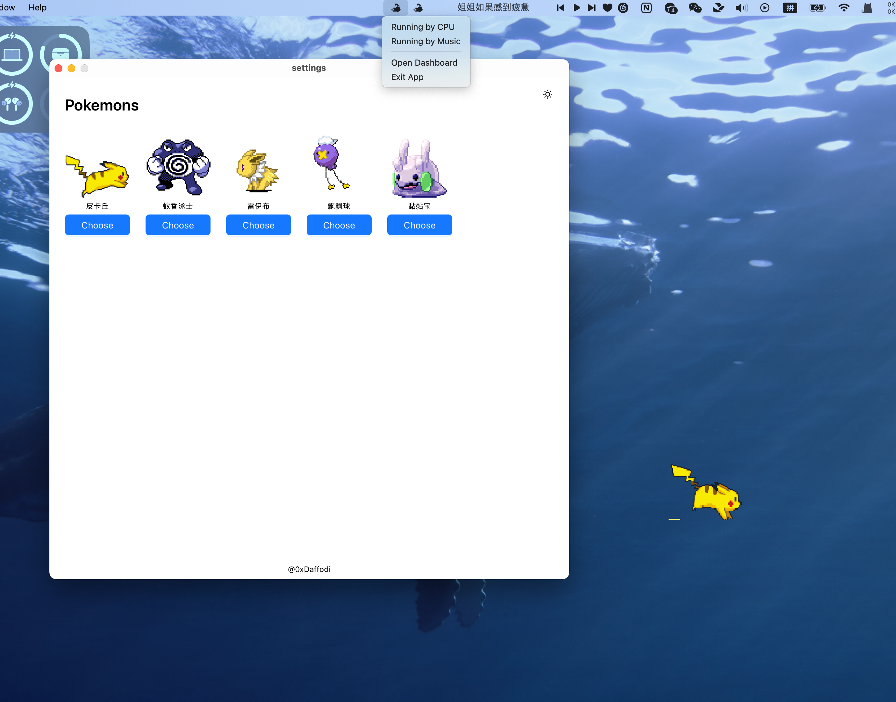

<div align="center">
    
    <h1 align="center">Pet on Window</h1>
    <p align="center"><b>Keep a pet (temporarily some pokemons now) on your desktop. It may have many unexpected functions!</b></p>
    <p align="center"><b>在你的桌面上养一只宠物，它可能会带来很多意想不到的功能！</b></p>
</div>

## 🛠️ Tech Stack

- **[Tauri](https://tauri.app/)** — lightweight, secure desktop app framework
- **[React](https://react.dev/)** — for rich interactive user interfaces
- **JavaScript/TypeScript** — application logic & UI
- **Rust** — for native backend (via Tauri)
- **[Gifuct-js](https://github.com/matt-way/gifuct-js)** — for pet animations speed control
- **[Ant Design](https://ant.design/)** — for UI components

## ✨ Features (For now...)



-   drag pet on your main monitor
-   As your computer's CPU usage increases, the pet will run faster and faster.
-   Select your favorite pokemon from the dashboard.

## 🤝 Contributing

This is currently a small project for **fun** and **study**, and I'm still trying to add more interesting gameplay to the running-Pikachu. If you have any **suggestions** or **ideas**, feel free to leave me a message!!!


## 🚀 Get Started

```shell
# test dev
$ pnpm install
$ pnpm tauri dev

# install on system
$ pnpm tauri build
```

## License

[MIT](./LICENSE)