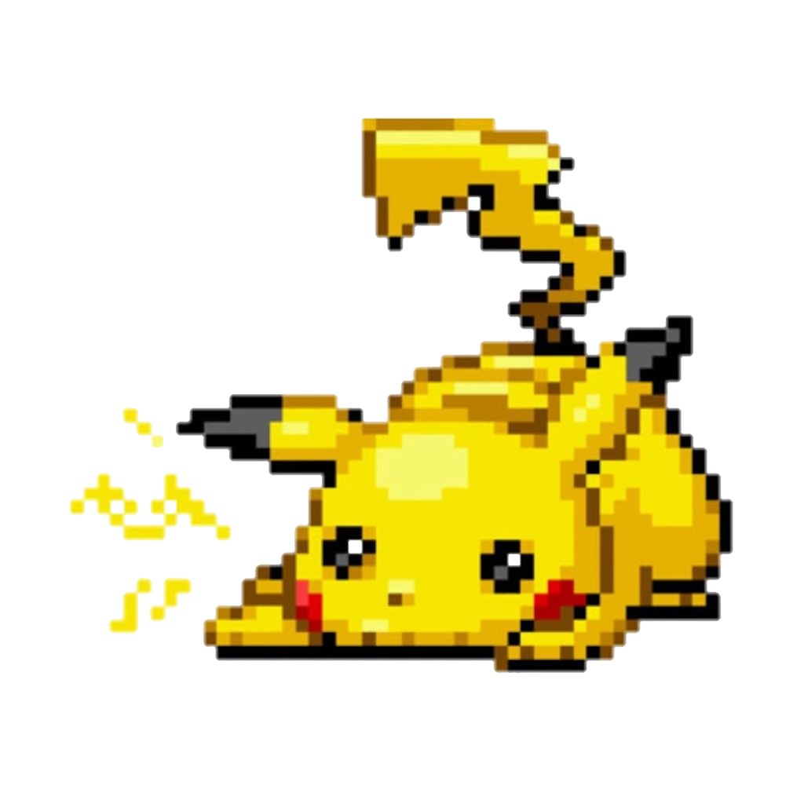

# Pet on Window

<div style="display: flex; align-items: center; justify-content: center; flex-direction: column;">
  
  <p><b>Keep a pet on your desktop. It may have many unexpected functions!</b></p>
  <p><b>在你的桌面上养一只宠物，它可能会带来很多意想不到的功能！</b></p>
</div>


## 🛠️ Tech Stack

- **[Tauri](https://tauri.app/)** — lightweight, secure desktop app framework
- **[React](https://react.dev/)** — for rich interactive user interfaces
- **JavaScript/TypeScript** — application logic & UI
- **Rust** — for native backend (via Tauri)
- **[Gifuct-js](https://github.com/matt-way/gifuct-js)** — for pet animations speed control
- **[Ant Design](https://ant.design/)** — for UI components
- **[axios](https://axios-http.com/)** — for HTTP requests


## 🚀 Get Started

```shell
# test dev
$ pnpm install
$ pnpm tauri dev

# install on system
$ pnpm tauri build
```


## License

[MIT](./LICENSE)